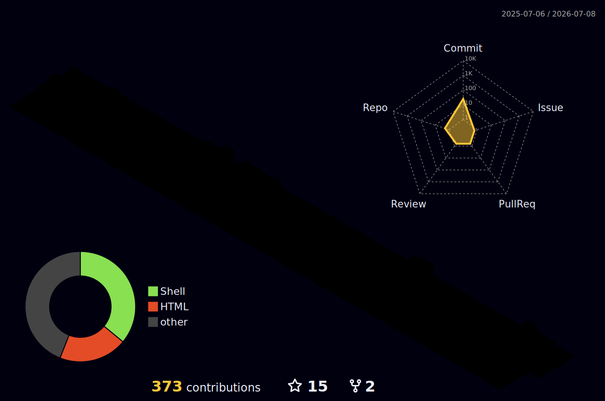

<div align="center">

<!-- ANIMATED HEADER - 3D Waving Banner -->


<!-- ANIMATED TYPING SVG -->
[](https://git.io/typing-svg)

</div>

---

<div align="center">

<!-- CONTRIBUTION SNAKE ANIMATION -->
<picture>
  <source media="(prefers-color-scheme: dark)" srcset="https://raw.githubusercontent.com/platane/snk/output/github-contribution-grid-snake-dark.svg">
  <source media="(prefers-color-scheme: light)" srcset="https://raw.githubusercontent.com/platane/snk/output/github-contribution-grid-snake.svg">
  
</picture>


</div>

---


```zsh
╔═══════════════════════════════════════════════╗
║        SYSTEM BOOT: pasindu@blackhatter        ║
╠═══════════════════════════════════════════════╣
║  OS         › Engineer Brain v27.0            ║
║  Shell      › zsh  [ ✓ oh-my-zsh loaded ]    ║
║  Primary    › Flutter + Dart  📱              ║
║  Secondary  › React + Node.js 🌐              ║
║  DB         › MongoDB + MySQL + Firebase      ║
║  Mission    › Build apps people actually love ║
║  Philosophy › Clean code or no code           ║
║  Status     › [████████████████░░] shipping.. ║
╚═══════════════════════════════════════════════╝
```

<br clear="right"/>

---

<div align="center">

### `> ./connect.sh --open-all`

[](https://www.linkedin.com/in/pasindu-prabhath/)
[](https://x.com/pasindu_indie)
[](mailto:pasinduprabhath@gmail.com)
[](https://discord.com/users/BlackHatter%233225)
[](https://t.me/Blackhatter)

</div>

---

## `> cat skills.json | jq`

<table align="center">
<tr>
<td valign="top" width="33%">

### 📱 Mobile & App Dev


</td>
<td valign="top" width="33%">

### 🌐 Web Frontend


</td>
<td valign="top" width="33%">

### ⚙️ Backend & Data


</td>
</tr>
</table>

---

## `> github-stats --3d-render 🎲`

<div align="center">

<!-- 3D ISOMETRIC CONTRIBUTION GRAPH -->


</div>


---

## `> streak --blaze 🔥`

<div align="center">


</div>

---

## `> tail -f activity.log`

<div align="center">


</div>

---

## `> trophy-case --all`

<div align="center">


</div>

---

## `> profile-summary --breakdown`

<div align="center">


</div>

---

<div align="center">

<!-- CAPSULE RENDER ANIMATED FOOTER -->


<!-- ANIMATED QUOTE BADGE -->
[](https://github.com/ABSphreak/readme-jokes)

```dart
// life.dart — the algorithm
void main() async {
  while (await isAlive()) {
    await eat();
    await sleep();
    await code();   // ← prioritize this one
    await ship();   // ← don't forget this either
  }
}
```


</div>
